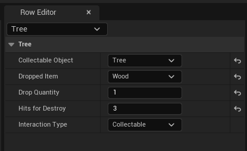
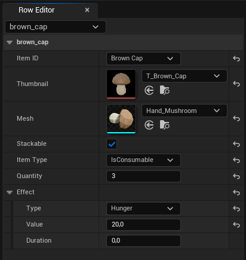

  

    Begin
    <strong class="meta-value">08/2024</strong>
  

  EIGENER C++-CODE
  <strong class="meta-value meta-value-wrap">
    ca.
    0
  </strong>
  <strong class="meta-suffix">Zeilen</strong>

  

    Programmiersprache
    <strong class="meta-value">C++</strong>
  

  

    Engine
    <strong class="meta-value">Unreal Engine 5</strong>
  

> **Hinweis zum Quellcode.**  
> Da sich das Projekt in aktiver Entwicklung befindet und langfristig veröffentlicht werden soll, ist der vollständige Quellcode nicht öffentlich. Die gezeigten Ausschnitte stammen aus dem produktiven Projekt und wurden auf die für dieses Portfolio relevanten Architekturentscheidungen reduziert.

## Überblick

Seit August 2024 entwickle ich eigenständig ein Survival-Spiel mit Unreal Engine 5 und C++. Aus einem zunächst kleinen Lernprojekt entstand dabei ein umfangreiches Softwaresystem mit ca. 7.500 Zeilen eigenem C++-Code.

Mit wachsendem Funktionsumfang stiegen auch die Anforderungen an die Architektur. Bestehende Systeme wurden deshalb mehrfach refaktoriert, um Verantwortlichkeiten klarer zu trennen, direkte Abhängigkeiten zu reduzieren und Komponenten wiederverwendbar zu machen.

Ein zentraler Teil des Projekts ist dabei die kontinuierliche Weiterentwicklung der Architektur: Entscheidungen werden nicht nur nach ihrer aktuellen Funktionalität bewertet, sondern auch danach, wie gut sie sich unter wachsender Komplexität erweitern und warten lassen.

## Architektur

### Von Klassenexplosion zu datengetriebenem Design

Im Initial Commit war jede Ressource im Spiel eine eigene Actor-Subklasse. `ACoal`, `AIron`, `AGold`, `ADiamond`, `AStone` und `ATree` erbten alle von `ACollect` und unterschieden sich nur durch fest verdrahtete Konstruktor-Parameter:

<pre><code>// Tree.cpp
#include "Tree.h"

ATree::ATree()
    : ACollect(ECollectables::Tree, EItemID::wood, 32) { }

...</code></pre>

Sechs praktisch identische Klassen, deren einziger Unterschied drei hartcodierte Werte im Konstruktor sind – jede neue Ressource bedeutete eine neue C++-Klasse plus Blueprint.

Bereits im zweiten Commit sind diese Subklassen verschwunden. Stattdessen gibt es eine einzige, parametrisierte `ACollect`-Klasse, die über einen Enum-Typ (`ECollectables`) und eine `FCollectable`-Struktur beschrieben wird:

<pre><code>// Collect.h
USTRUCT(BlueprintType)
struct FCollectable
{
    GENERATED_BODY()

    UPROPERTY(EditAnywhere, BlueprintReadWrite)
    ECollectables CollectableObject = ECollectables::Empty;

    UPROPERTY(EditAnywhere, BlueprintReadWrite)
    EItemID DroppedItem = EItemID::empty;

    UPROPERTY(EditAnywhere, BlueprintReadWrite)
    int DropQuantity = 0;
};

UCLASS()
class FARMINGGAME_API ACollect : public AClickableActor
{
    GENERATED_BODY()

public:
    ACollect();
    FCollectable&amp; GetCollectable();

private:
    UPROPERTY()
    FCollectable Collectable;
};</code></pre>

Neue Ressourcentypen benötigen seitdem keine eigene C++-Klasse mehr, sondern werden über die vorhandene Struktur und Daten konfiguriert.

### Verantwortlichkeiten durch Components trennen

Wiederverwendbare Verantwortlichkeiten wurden in eigene Komponentenklassen ausgelagert, die sich an beliebige Objekte im Spiel anhängen lassen. Die Verantwortlichkeiten wurden gezielt auf separate Komponenten aufgeteilt, sodass die einzelnen Funktionen unabhängig voneinander wiederverwendet werden können.

<pre><code>// CollectableComponent.h
UCLASS(ClassGroup=(Custom), meta=(BlueprintSpawnableComponent))
class FARMINGGAME_API UCollectableComponent : public UActorComponent
{
    GENERATED_BODY()

public:
    FCollectable&amp; GetCollectable();

private:
    UPROPERTY(EditAnywhere, BlueprintReadWrite, Category = "Collectable", Meta = (AllowPrivateAccess = "true"))
    ECollectables CollectableType;

    FCollectable Collectable;
};

// ProgressComponent.h
class UProgressBarWidget;

UCLASS(ClassGroup=(Custom), meta=(BlueprintSpawnableComponent))
class FARMINGGAME_API UProgressComponent : public UWidgetComponent
{
    GENERATED_BODY()

public:
    void ShowProgress();
    void HideProgress();
    void SetProgress(const float Progress) const;

private:
    UPROPERTY()
    TObjectPtr&lt;UProgressBarWidget&gt; ProgressWidget;
};</code></pre>

`UCollectableComponent` kapselt ausschließlich die Collectable-Daten eines Objekts, `UProgressComponent` ausschließlich die Fortschrittsanzeige beim Abbauen. Beide sind unabhängig voneinander wiederverwendbar, ohne dass ein Objekt, das nur eine der beiden Funktionen braucht, die andere mitschleppen muss.

### Auflösung eines "God-Managers" in fokussierte Subsysteme

Damit mehrere Systeme miteinander kommunizieren können, wurde ein `UItemCollectionManager` eingeführt. Mit der Zeit wuchs er jedoch zu einer God-Class heran, da er direkte Abhängigkeiten zu Character-, Controller-, Equipment-, Inventory- und Collect-Klassen besaß:

<pre><code>UCLASS()
class FARMINGGAME_API UItemCollectionManager : public
UGameInstanceSubsystem
{
    GENERATED_BODY()

public:
    void NotifyCollectResource(ACollect* CollectedActor);
    void NotifyScrollInventory(FItem&amp; CurrentSelectedItem);
    void ResetEquipment();

    UPROPERTY(EditAnywhere, BlueprintReadWrite, Category = "Equipment")
    TMap&lt;EEquipmentType, TObjectPtr&lt;UEquipment&gt;&gt; EquipmentMap;

private:
    TObjectPtr&lt;ACollect&gt; CurrentCollectable = nullptr;
    TObjectPtr&lt;AInventory&gt; Inventory = nullptr;
    TObjectPtr&lt;AFarmingGameCharacter&gt; PlayerCharacter = nullptr;
    TObjectPtr&lt;AFarmingGamePlayerController&gt; PlayerController = nullptr;
};</code></pre>

Durch ein Refactoring wurde der `UItemCollectionManager` aufgeteilt in einen `UEquipmentManager` (reine Equipment-Logik) und einen `UPlayerInventoryManager` (reine Inventar-Verwaltung). Dadurch wurden die Verantwortlichkeiten klar getrennt und direkte Abhängigkeiten zwischen den beteiligten Systemen reduziert.

<pre><code>UCLASS()
class FARMINGGAME_API UEquipmentManager : public UGameInstanceSubsystem
{
    GENERATED_BODY()

public:
    virtual void Initialize(FSubsystemCollectionBase&amp; Collection) override;
    void NotifyScrollInventory(FItem&amp; CurrentSelectedItem);
    UEquipment* GetCurrentEquipment();
    bool HandleIfEquipToolCanCollectObject(ECollectables Collectable);
    void HandleIdle();
    void HandleHold();
    void HandleUse();

private:
    UPROPERTY()
    TMap&lt;EEquipmentType, TObjectPtr&lt;UEquipment&gt;&gt; EquipmentMap;
};</code></pre>

 

<pre><code>// PlayerInventoryManager.h
class UInventory;

UCLASS()
class FARMINGGAME_API UPlayerInventoryManager : public UGameInstanceSubsystem
{
    GENERATED_BODY()

public:
    void RegisterInventory(EItemCollectionEventManagerTypes EventManagerType, UObject* ObjectClassToSubscribe);
    int GiveItem(EItemID ItemID, int Quantity);
    UInventory* GetInventory(EInventoryType Type) const;

private:
    UPROPERTY()
    TMap&lt;EInventoryType, TObjectPtr&lt;UInventory&gt;&gt; Inventories;
};</code></pre>

Durch eventbasierte Kommunikation habe ich direkte Abhängigkeiten zwischen den beteiligten Subsystemen reduziert. Das Inventory-System muss seine Konsumenten nicht mehr kennen: Es veröffentlicht Änderungen über Delegates, auf die interessierte Systeme und Widgets unabhängig reagieren können. Das reduziert die direkte Kopplung zwischen den beteiligten Systemen.

<pre><code>DECLARE_DYNAMIC_MULTICAST_DELEGATE_OneParam(FOnInventoryChanged, const TArray&lt;FItem&gt;&amp;, Inventory);</code></pre>

`UEquipmentManager` und `UPlayerInventoryManager` kennen sich dadurch nicht gegenseitig. Beide reagieren lediglich auf relevante Events, die beispielsweise vom Inventory oder der Hotbar ausgelöst werden. Änderungen an einem System können dadurch erfolgen, ohne die abhängigen Systeme direkt anpassen zu müssen.

## Die größte Herausforderung

Das Inventory-System entwickelte sich zum komplexesten zusammenhängenden Teil des Projekts. Mit wachsendem Funktionsumfang kamen neben der eigentlichen Inventarverwaltung auch Interaktionslogik, eine Hotbar und mehrere UI-Komponenten hinzu. In der ursprünglichen Architektur lagen diese Verantwortlichkeiten weitgehend in einer Klasse und waren dadurch stark miteinander gekoppelt.

Um die entstehende Komplexität zu reduzieren, wurde das System in mehreren Schritten refaktoriert.

### 1. Entkopplung der UI durch Events

Zunächst wurde die direkte Abhängigkeit zwischen Inventory und UI entfernt. Das Inventory veröffentlicht Änderungen über Events, auf die die Widgets reagieren.

Dadurch kennt das Inventory seine UI-Konsumenten nicht mehr und die Darstellung kann unabhängig von der Datenhaltung weiterentwickelt werden.

<pre><code>MyInventory-&gt;OnInventoryChanged.AddDynamic( this, &amp;UInventoryWidget::PopulateInventory );</code></pre>

### 2. Separate Hotbar durch Spezialisierung

Die Hotbar verwendet die gemeinsame Inventarlogik von `UInventory`, benötigt aber zusätzliche Regeln für die aktive Slot-Auswahl und das Scrollverhalten.

Statt diese Sonderfälle in `UInventory` zu integrieren, wurde `UHotbar` als Spezialisierung von `UInventory` eingeführt. Die gemeinsame Funktionalität bleibt dadurch zentral in der Basisklasse, während die Hotbar nur ihr spezifisches Verhalten ergänzt.

<pre><code>// Hotbar.h
UCLASS(ClassGroup=(Custom), meta=(BlueprintSpawnableComponent))
class FARMINGGAME_API UHotbar : public UInventory
{
    GENERATED_BODY()

public:
    UHotbar();

    virtual void Scroll( float AxisValue ) override;

    UFUNCTION()
    FItem&amp; GetSelectedItem();

    virtual void UpdateInventoryUI() override;
    virtual bool CanSelectItem( int Index, EItemSelectOption ItemSelectOption ) override;
};</code></pre>

### 3. Zentraler Datenzugriff über DataTableManager

Mit zunehmender Anzahl an Systemen stieg auch die Anzahl der benötigten DataTables. Statt die Tabellen in verschiedenen Klassen einzeln zu referenzieren und zu laden, wurde ein zentraler `UDataTableManager` eingeführt.

Der Manager stellt eine einheitliche Schnittstelle für den Zugriff auf unterschiedliche Tabellen bereit. Die DataTables werden beim ersten Zugriff geladen und anschließend für die Lebensdauer der `GameInstance` gecached. Dadurch müssen die einzelnen Systeme weder wissen, wo die Tabellen konfiguriert sind, noch sich um deren Lade- und Cache-Zustand kümmern.

<pre><code>// DataTableManager.h
UCLASS()
class FARMINGGAME_API UDataTableManager : public UGameInstanceSubsystem
{
    GENERATED_BODY()

public:
    template&lt;typename TRow, typename TEnum&gt;
    const TRow* FindRow(EDataTable TableType, TEnum EnumValue) const;

private:
    mutable TMap&lt;EDataTable, TObjectPtr&lt;UDataTable&gt;&gt; CachedDataTables;
};</code></pre>

Durch die Template-basierte Schnittstelle kann derselbe Zugriff für unterschiedliche Row-Typen verwendet werden:

<pre><code>const FItem* Item = DataTableManager-&gt;FindRow&lt;FItem&gt;(EDataTable::Items, EItemID::wood);</code></pre>

Damit bleibt der konkrete Zugriff auf DataTables von den Gameplay-Systemen getrennt und erfolgt über eine zentrale, einheitliche API.
 
 
#### Beispiel: Item-Daten

    <!-- Linke Seite: Code -->
    

        

            <pre><code>// Data.h
USTRUCT(BlueprintType)
struct FItem : public FTableRowBase
{
    GENERATED_BODY()

    EItemID ItemID = EItemID::empty;
    TSoftObjectPtr&lt;UTexture2D&gt; Thumbnail;
    TSoftObjectPtr&lt;UStaticMesh&gt; Mesh;
    bool Stackable = false;
    EItemType ItemType = EItemType::IsMaterial;
    int Quantity = 0;
    FItemEffect Effect;
};</code></pre>
        

    

    <!-- Rechte Seite: Bild -->
    

        
    

### 4. Auslagerung der Interaktionslogik

Ein weiterer Problembereich war die eigentliche Interaktion mit Items: Verschieben, Stapeln, Aufteilen und Tauschen.

Diese Logik lag ursprünglich direkt im Inventory. Dadurch war die Interaktion auf ein einzelnes Inventar zugeschnitten. Ein Item zwischen Spielerinventar und Hotbar oder zwischen zwei beliebigen Inventaren zu verschieben, erforderte zusätzliche Sonderfälle.

Die Interaktionslogik wurde deshalb in `UInventoryInteraction` ausgelagert. Die Klasse arbeitet mit dem jeweils betroffenen `UInventory` und kann dadurch Operationen unabhängig davon ausführen, welchem konkreten Inventar die Slots gehören.

<pre><code>// InventoryInteraction.h
UCLASS()
class FARMINGGAME_API UInventoryInteraction : public UObject
{
    GENERATED_BODY()

    ...

private:
    UPROPERTY()
    TObjectPtr&lt;UInventory&gt; SourceInventory = nullptr;

    EItemSelectOption SelectClickOption(const FInventoryClickContext&amp; Context) const;

    void DoClickOption(EItemSelectOption Option, const FInventoryClickContext&amp; Context, UInventory* Inventory);

    bool SplitStack(UInventory* Inv, int Index);

    void HandleEmpty(UInventory* Inv, int Index);
    void HandleStack(UInventory* Inv, int Index);
    void HandleSwap(UInventory* Inv, int Index);
};</code></pre>

### 5. Koordination mehrerer Inventare

Mit mehreren Inventaren entstand ein weiteres Problem: Beim Aufsammeln eines Items muss nicht nur geprüft werden, ob ein bestimmtes Inventar Platz bietet, sondern welches der verfügbaren Inventare das Item aufnehmen kann.

Diese Entscheidung wurde aus `UInventory` herausgehalten und in einen `UPlayerInventoryManager` ausgelagert. Der Manager verwaltet die registrierten Inventare und koordiniert das Hinzufügen eines Items. Er prüft, ob ein passender Stack oder freier Slot vorhanden ist, und delegiert die eigentliche Inventaroperation an das jeweilige `UInventory`.

Damit bleibt `UInventory` für die Verwaltung eines einzelnen Inventars verantwortlich, während der Manager die Zusammenarbeit mehrerer Inventare koordiniert.

<pre><code>// PlayerInventoryManager.h
class UInventory;

UCLASS()
class FARMINGGAME_API UPlayerInventoryManager : public UGameInstanceSubsystem
{
    GENERATED_BODY()

public:
    void RegisterInventory(EItemCollectionEventManagerTypes EventManagerType, UObject* ObjectClassToSubscribe);
    int GiveItem(EItemID ItemID, int Quantity);
    UInventory* GetInventory(EInventoryType Type) const;

private:
    UPROPERTY()
    TMap&lt;EInventoryType, TObjectPtr&lt;UInventory&gt;&gt; Inventories;
};</code></pre>

## Fazit

Das Projekt hat mir gezeigt, dass Architektur mit dem System wachsen muss.

Mehrfach stießen ursprüngliche Lösungen mit wachsendem Funktionsumfang an ihre Grenzen. Durch gezielte Refactorings konnten Verantwortlichkeiten getrennt, Abhängigkeiten reduziert und Systeme wiederverwendbarer gemacht werden.

Für mich gehört deshalb nicht nur das Entwerfen neuer Systeme zur Softwareentwicklung, sondern auch das kritische Hinterfragen und Weiterentwickeln bestehenden Codes.
